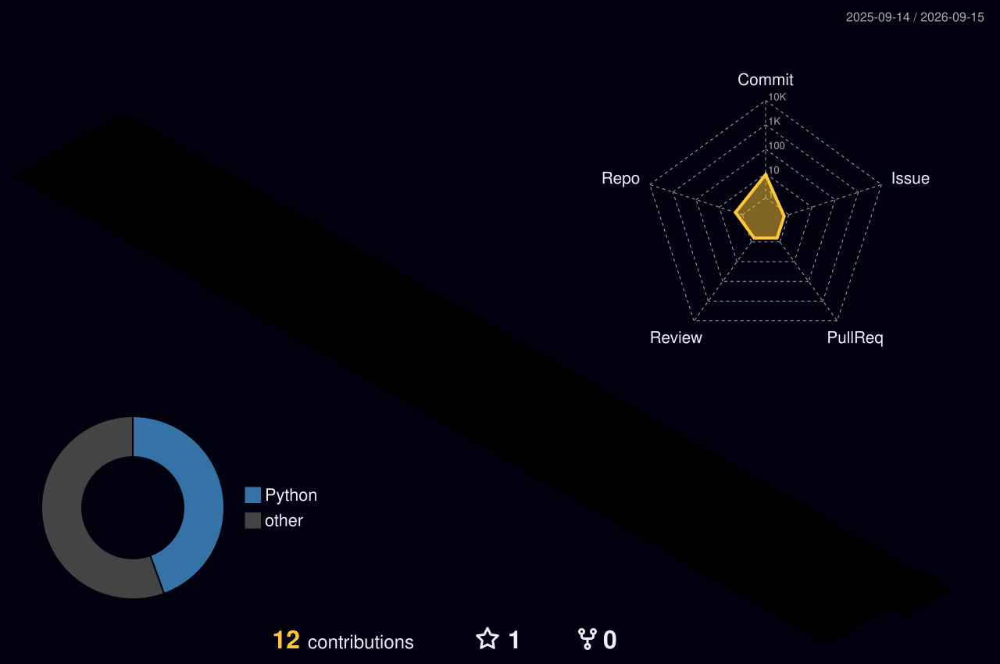

  

  

  
  
  

⸻

## 🎓 Who I am

Computer Science student at **UNESP** — Universidade Estadual Paulista "Júlio de Mesquita Filho", currently turning my Python skills toward **RPA and process automation**. I like taking repetitive, boring tasks and teaching a script to do them instead — so I get more time for the interesting problems.

Right now I'm building an **end-to-end supplier-registration automation**: it reads a spreadsheet, validates and enriches the data through a public API, saves everything to a SQL database, and fills out a web form on its own using Selenium. Basically, I built a robot so I don't have to do data entry by hand. 🤖

⸻

## 🛠️ What I build with

  

  

⸻

## 🚀 Featured project

> **Supplier Registration Automation** — reads a spreadsheet, validates records, enriches data via a public REST API, persists to a SQL database, and auto-fills a web form with Selenium. My proof that Python + a little patience can replace an entire afternoon of copy-paste.

⸻

## 📊 Activity

  
  

  

⸻

## 🏙️ 3D Contribution Skyline

  

⸻

## 🐍 The snake that eats my commits

  

⸻

## 📬 Let's talk

  Open to Junior Developer, Python, and RPA opportunities — feel free to reach out.

  

  

  

